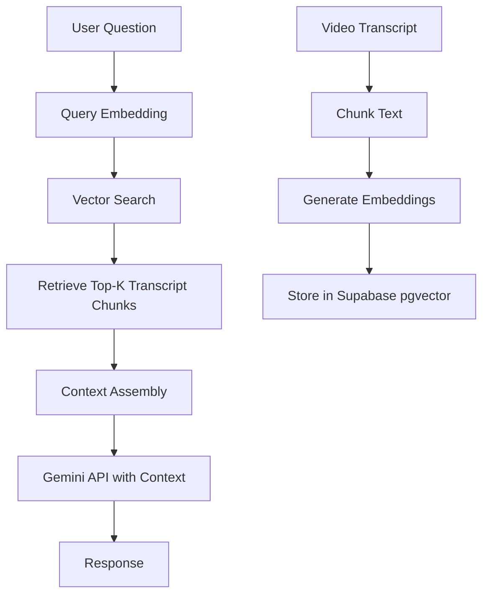

# AI Engineering Architecture - Consistency Lab

This document details the AI/ML engineering concepts and implementation strategies for Consistency Lab.

## AI/ML Technology Stack

### Core AI Services

**Gemini API Integration**
- **Gemini 2.5 Flash**: All AI tasks (chatbot, quiz generation, summaries, analysis)
- Multimodal capabilities (text, images, video frames)
- Long context window (1M tokens)
- **Text Embeddings**: `text-embedding-004` for semantic search and RAG

**Why Gemini 2.5 Flash?**
- **Fast**: Low latency for conversational responses
- **Cost-effective**: Free tier is generous (15 RPM, 1,500 RPD)
- **Capable**: Handles complex analysis, reasoning, and content generation
- **Simplified**: Single model reduces complexity in prompt engineering and caching
- **Long context**: 1M tokens handles entire playlists and long transcripts

**Implementation Example**
```python
import google.generativeai as genai

# Initialize Gemini 2.5 Flash
genai.configure(api_key=os.getenv('GEMINI_API_KEY'))
model = genai.GenerativeModel('gemini-2.5-flash')

# Use for all tasks: summaries, quizzes, chatbot, analysis
response = model.generate_content(prompt)
```

**ML Libraries**
- **scikit-learn**: Completion prediction, clustering, regression
- **numpy/scipy**: Statistical analysis, time series forecasting
- **pandas**: Learning pattern analytics

---

## 1. RAG (Retrieval Augmented Generation) System

### Architecture



### Implementation Details

**Embedding Strategy**
- Chunk transcripts into 500-word segments with 50-word overlap
- Generate embeddings using Gemini `text-embedding-004` (768 dimensions)
- Store in Supabase with pgvector extension for similarity search
- Cache embeddings to avoid regeneration

**Retrieval Process**
1. Convert user question to embedding
2. Cosine similarity search in vector database
3. Retrieve top 3-5 most relevant chunks
4. Assemble context with video metadata (title, timestamp)
5. Send to Gemini with system prompt

**Context Window Management**
- Gemini 2.5 Flash: 1M token context window (handles entire playlists)
- Dynamic context pruning based on relevance scores
- Prioritize recent conversation history

---

## 2. Prompt Engineering Templates

### Course Summary Generation

```python
PROMPT = """
You are an educational content analyst. Analyze the following YouTube course transcript.

TRANSCRIPT:
{transcript}

Provide:
1. **Summary**: 2-3 sentence course overview
2. **Key Topics**: List 5-7 main topics covered
3. **Difficulty Level**: Beginner/Intermediate/Advanced with justification
4. **Prerequisites**: Required background knowledge
5. **Learning Objectives**: 3-5 specific skills learners will gain

Format as JSON.
"""
```

### Quiz Generation

```python
PROMPT = """
You are an expert educator. Generate {num_questions} multiple-choice questions from this video transcript.

VIDEO: {video_title}
TRANSCRIPT:
{transcript}

Requirements:
- Questions should test understanding, not just recall
- Difficulty: {difficulty_level}
- Each question has 1 correct answer and 3 plausible distractors
- Include brief explanation for correct answer

Format:
{{
  "questions": [
    {{
      "question": "...",
      "correct_answer": "...",
      "wrong_answers": ["...", "...", "..."],
      "explanation": "..."
    }}
  ]
}}
"""
```

### Conversational Assistant (RAG)

```python
SYSTEM_PROMPT = """
You are a helpful learning assistant for the course: {course_title}.

CONTEXT FROM COURSE:
{retrieved_chunks}

Answer the user's question using ONLY the provided context. If you cannot answer from the context, say "I don't have enough information from this course to answer that."

Be concise, encouraging, and educational.
"""

USER_PROMPT = "{user_question}"
```

---

## 3. Adaptive Learning Algorithms

### Completion Probability Prediction

**Features (Input Variables)**
- Current completion percentage
- Days since last study session
- Average session length (minutes)
- Consistency score (% of scheduled days completed)
- Total course duration remaining
- Historical dropout patterns (from other users)

**Model: Logistic Regression**
```python
from sklearn.linear_model import LogisticRegression

# Features: [completion_pct, days_inactive, avg_session_mins, consistency_score, hours_remaining]
# Target: 0 = will drop out, 1 = will complete

model = LogisticRegression()
model.fit(X_train, y_train)

# Predict probability for current user
completion_prob = model.predict_proba(user_features)[0][1]
```

**Training Data**
- Historical user data from Supabase
- Retrain weekly as more data accumulates
- Initial cold-start: Use heuristics until 100+ user courses

### Adaptive Schedule Optimization

**Reinforcement Learning Approach**

**State**: User's current progress, engagement level, time of day
**Action**: Assign video difficulty (easy/medium/hard) for next session
**Reward**: +1 if user completes video, -0.5 if user skips, +0.2 for consistency

**Algorithm: Multi-Armed Bandit (Thompson Sampling)**
- Each "arm" = different scheduling strategy
- Track success rates per strategy
- Dynamically allocate users to best-performing strategies

**Strategies to Test**
1. Front-load difficult content
2. Interleave difficulty levels
3. Progressive difficulty increase
4. User preference matching

---

## 4. Learning Analytics & Insights

### Study Pattern Analysis

**Time-of-Day Optimization**
```python
import numpy as np
from scipy import stats

# Analyze completion rates by hour
hourly_completion = df.groupby('hour_of_day')['completed'].mean()

# Find optimal study windows
optimal_hours = hourly_completion[hourly_completion > 0.7].index.tolist()

# Statistical significance test
chi2, p_value = stats.chisquare(hourly_completion)
```

**Struggling Topics Identification**
- Videos rewatched > 2 times → struggling
- Videos with >50% skips → too difficult
- Low quiz scores on topic → needs review

**Spaced Repetition Recommendations**
- Use Ebbinghaus forgetting curve
- Suggest review at: 1 day, 3 days, 7 days, 14 days
- Prioritize topics with low quiz scores

---

## 5. AI Caching Strategy

### Cache Layers

**Layer 1: Database Cache (Supabase)**
- Store all AI-generated content permanently
- Tables: `ai_course_insights`, `ai_quiz_questions`, `video_transcripts`
- Check cache before API call

**Layer 2: In-Memory Cache (Flask)**
- Redis or simple dict for frequently accessed prompts
- TTL: 1 hour for summaries, 24 hours for transcripts

**Layer 3: Client-Side Cache (Next.js)**
- React Query with stale-while-revalidate
- Cache AI responses in browser localStorage

### Cache Invalidation
- Regenerate summaries if transcript updated
- Quiz cache: permanent (unless manually refreshed)
- Chat history: never cached (always fresh)

---

## 6. Cost Optimization Techniques

### Gemini API Usage Optimization

**Token Counting**
```python
import google.generativeai as genai

# Estimate tokens before API call
prompt_tokens = model.count_tokens(prompt).total_tokens

# Only call API if under budget
if prompt_tokens < MAX_TOKENS_PER_REQUEST:
    response = model.generate_content(prompt)
```

**Batch Processing**
- Generate all quiz questions for a video in one API call
- Summarize entire playlist in one request (chunk if > 1M tokens)

**Model Selection**
- Use Gemini 2.5 Flash exclusively (fast, cost-effective, and capable)
- Single model simplifies caching and prompt engineering

**Free Tier Management**
- Free tier: 15 RPM, 1,500 RPD
- Rate limiting on backend
- Queue requests if limit exceeded

### Estimated Costs (Free Tier)

**Per User Per Month**
- 5 playlists analyzed: 5 summaries (100 requests/month)
- 50 quiz questions: 10 quiz generation calls
- 100 chatbot messages: 100 requests
- **Total: ~210 requests/month** → Well within 1,500/day free tier

---

## 7. Vector Database Design (Supabase pgvector)

### Schema

```sql
CREATE EXTENSION IF NOT EXISTS vector;

CREATE TABLE video_embeddings (
  id UUID PRIMARY KEY DEFAULT gen_random_uuid(),
  video_id TEXT NOT NULL,
  chunk_index INT NOT NULL,
  chunk_text TEXT NOT NULL,
  embedding vector(768),
  metadata JSONB,
  created_at TIMESTAMP DEFAULT NOW()
);

CREATE INDEX ON video_embeddings USING ivfflat (embedding vector_cosine_ops)
  WITH (lists = 100);
```

### Similarity Search Query

```sql
SELECT 
  chunk_text, 
  metadata,
  1 - (embedding <=> $1::vector) AS similarity
FROM video_embeddings
WHERE video_id = $2
ORDER BY embedding <=> $1::vector
LIMIT 5;
```

---

## 8. AI Feature Roadmap

### Phase 1 (MVP)
- ✅ Course summary generation
- ✅ Basic chatbot with RAG
- ✅ Quiz generation

### Phase 2 (Enhancement)
- ✅ Adaptive scheduling
- ✅ Completion probability prediction
- ✅ Learning analytics dashboard

### Phase 3 (Advanced)
- 🔮 Multi-modal learning (analyze video frames, not just transcripts)
- 🔮 Peer comparison analytics
- 🔮 AI-generated flashcards with spaced repetition
- 🔮 Voice-based learning assistant

---

## 9. Ethical AI Considerations

**Transparency**
- Clearly label AI-generated content
- Show confidence scores for predictions

**Privacy**
- Never share user data across accounts
- Anonymize data for ML training

**Fairness**
- Avoid bias in difficulty predictions
- Test across diverse content types

**Accuracy**
- Validate AI quiz answers manually (sample)
- Allow users to report incorrect information
